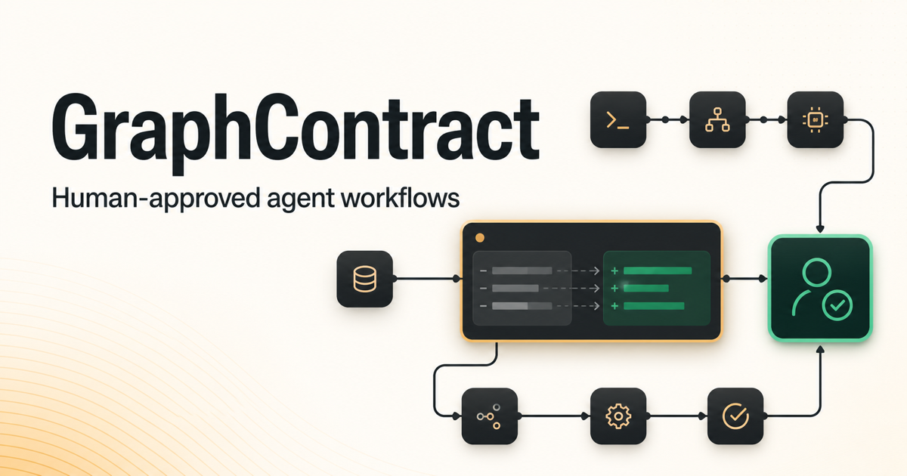

# GraphContract

**Design agent behavior together—before it becomes code.**

GraphContract lets humans and coding agents visually plan, review, and freeze how an agent should behave before implementation. A coding agent can inspect the accepted contract, propose structured graph changes through WebMCP, and derive deterministic scenarios—but only a human can approve, reject, or freeze the result.

[Live canvas](https://graphcontract.dev/) · [GitHub repository](https://github.com/vijaybadana/graphcontract) · [The WebMCP Challenge](https://webmcp.devpost.com/) · [Architecture](docs/architecture.md) · [WebMCP contracts](docs/contracts.md)



## Why GraphContract

Agent workflows are usually reviewed after they have already become code, prompts, and framework-specific configuration. That makes branching behavior, human approval gates, parallel work, retries, and sensitive effects difficult to inspect as one coherent system.

GraphContract adds a planning layer before implementation:

1. A human or coding agent starts from a blank canvas or a reusable graph.
2. The coding agent reads the accepted contract and proposes a structured revision.
3. GraphContract renders the candidate as a reviewable visual diff without changing the accepted graph.
4. The human inspects the proposal, requests changes, approves it, or rejects it.
5. GraphContract derives deterministic branch scenarios for review.
6. The human freezes the approved contract and downloads implementation handoff artifacts.

That sequence is the recommended demo journey: open a library graph, let an agent inspect and propose a revision through WebMCP, review the visual diff, request a correction or approve it, inspect the deterministic scenarios, then freeze and download the handoff pack.

## What people and agents can do together

- Plan workflows with Start, Task, Agent, Tool, Human, Merge, End, and nested Subgraph structures.
- Express normal, conditional, command, fallback, bounded loop, and dynamic `Send ×N` routing.
- Add human-in-the-loop gates and explicit policy around sensitive effects.
- Review agent-authored changes before they affect the accepted graph.
- Inspect deterministic paths through the contract and focus each scenario on the canvas.
- Preview read-only runtime instances for dynamic parallel work.
- Freeze a reviewed contract and export its graph, scenarios, and Python path-test handoff.

## WebMCP

The application registers exactly three browser-native WebMCP tools with `document.modelContext.registerTool(...)`:

| Tool | Purpose |
| --- | --- |
| `get_graph` | Read the accepted graph, its revision identity, validation state, and any outstanding human review request. |
| `propose_graph_changes` | Submit a structured, review-only candidate. The accepted graph remains unchanged until a human approves it in the UI. |
| `get_branch_scenarios` | Read deterministic scenarios derived from the accepted graph. |

The WebMCP boundary is intentionally narrow. Agents cannot approve or reject proposals, freeze or unfreeze contracts, answer human gates, control runtime execution, load library templates, or download artifacts. Those actions remain human-owned in the interface.

## Agent skill

GraphContract publishes a portable agent skill and machine-readable discovery index:

- [`/.well-known/agent-skills/graphcontract/SKILL.md`](https://www.graphcontract.dev/.well-known/agent-skills/graphcontract/SKILL.md)
- [`/.well-known/agent-skills/index.json`](https://www.graphcontract.dev/.well-known/agent-skills/index.json)

The skill teaches a browser-capable coding agent the GraphContract lifecycle: inspect, propose, review, revise, derive scenarios, freeze, and hand off—while preserving the same human authority boundary.

## Architecture and technology

GraphContract is a React 19 and Next.js 16 application built through Vinext/Vite and deployed to Netlify. React Flow owns canvas projection and interaction; Zustand owns local workspace state and history; Zod owns canonical schema validation; Phosphor supplies the icon system. Vitest and Testing Library cover domain and component behavior, while Playwright exercises the browser, persistence, downloads, and real page-registered WebMCP tools.

The accepted graph remains the canonical contract. Proposal diffs, scenario focus, and optional runtime fixtures are projections around that graph; they do not grant runtime execution authority or silently mutate the accepted topology.

## Run locally

Requirements: Node.js 22.13 or newer.

```bash
npm install
npm run local:run -- --run-id graphcontract-local
```

Open `http://127.0.0.1:3000` in ChatGPT's in-app browser or Google Chrome with WebMCP testing enabled.

The managed local runtime can be inspected, reloaded, restarted, and stopped with:

```bash
npm run local:status -- --run-id graphcontract-local
npm run local:reload -- --run-id graphcontract-local
npm run local:restart -- --run-id graphcontract-local
npm run local:stop -- --run-id graphcontract-local
```

See [docs/operator-commands.md](docs/operator-commands.md) for the complete supported command surface.

## Verify

```bash
npm run test:dev          # lint + unit/component tests
npm run test:integration  # Playwright browser acceptance suite
npm run build             # production build
```

The browser suite exercises the real page-registered WebMCP tools as well as proposal authority, graph editing, scenarios, freezing, downloads, persistence, accessibility, responsive layout, and runtime preview behavior.

## Project documentation

- [Product scope](docs/product-scope.md)
- [Architecture](docs/architecture.md)
- [Data and WebMCP contracts](docs/contracts.md)
- [Operator and validation commands](docs/operator-commands.md)
- [Playwright regression coverage](docs/qa/playwright-regression.md)
- [Implementation program](docs/implementation-program/README.md)

## Built for The WebMCP Challenge

GraphContract was created during [The WebMCP Challenge](https://webmcp.devpost.com/) to explore a web experience that is meaningfully better when humans and agents collaborate. WebMCP is not an auxiliary integration here: it is how an external coding agent reads accepted intent and submits a constrained, inspectable proposal while the browser UI retains human control.

## License

Released under the [MIT License](LICENSE). Third-party acknowledgements and retained license notices are listed in [THIRD_PARTY_NOTICES.md](THIRD_PARTY_NOTICES.md).
